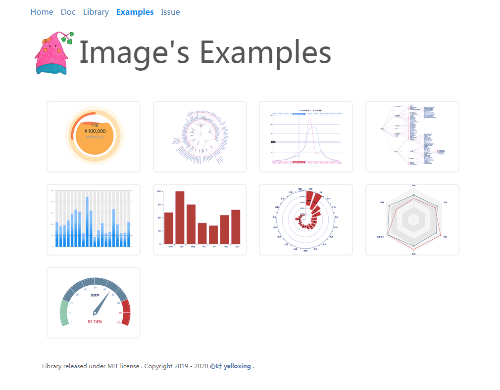

<p align="center"><a href="https://yelloxing.gitee.io/image2D/index.html" target="_blank" rel="noopener noreferrer">
</a></p>

<p align="center">
  <a href="https://yelloxing.gitee.io/npm-downloads?interval=7&packages=image2d"></a>
  <a href="https://packagephobia.now.sh/result?p=image2d"></a>
  <a href="https://www.jsdelivr.com/package/npm/image2d"></a>
  <a href="https://www.npmjs.com/package/image2d"></a>
  <a href="https://github.com/yelloxing/image2D/blob/master/LICENSE"></a>
</p>

<h2 align="center">关于项目</h2>

使用ECMAScript绘制二维图片,开发这个库的初衷是希望越来越多的人可以更自由的发挥自己的创意，感受绘图的乐趣，并把积累的经验分享出来，推动库本身的发展，从而不断优化！因此，这个库永远都是自由、开源、讨论和进步的。

```html
<script src="https://cdn.jsdelivr.net/npm/image2d@1.8.2/build/image2D.min.js"></script>
```

你可以通过CDN的方式引入（[版本历史](https://github.com/yelloxing/image2D/blob/master/.github/CHANGELOG)），在代码中通过image2D或$$调用，当然，你也可以通过npm的方式引入。

```bash
npm install --save image2d
```

安装好了以后，在需要的地方引入即可：

```js
import $$ from 'image2d';
```

具体的接口或相关说明请查阅[接口文档](https://yelloxing.gitee.io/image2D/index.html)或者在遇到困难的时候通过[issue](https://github.com/yelloxing/image2D/issues)和我们取得联系！

<h2 align="center">图表用例</h2>

<p align="center"><a href="http://yelloxing.gitee.io/image2d-examples/index.html" target="_blank" rel="noopener noreferrer">
</a></p>

如果想加入其中可以通过[issue](https://github.com/yelloxing/image2D/issues)联系我们

## 相关项目

| Project | Status | Description |
|---------|--------|-------------|
| [image3D]          | [![image3D-status]][image3D-package] | 基于WebGL开发的3D绘图库 |
| [iCrush]          | [![iCrush-status]][iCrush-package] | 文档依赖框架 |
| [examples]          | [🍎 🍪 🍦 🍓][examples-websit] | 一些比较随意的用例 |

[image3D]: https://github.com/yelloxing/image3D
[iCrush]: https://github.com/yelloxing/iCrush
[examples]: https://github.com/yelloxing/2D-Examples

[image3D-status]: https://img.shields.io/npm/v/image3d.svg
[iCrush-status]: https://img.shields.io/npm/v/icrush.svg

[image3D-package]: https://npmjs.com/package/image3d
[iCrush-package]: https://npmjs.com/package/icrush

[examples-websit]: http://yelloxing.gitee.io/image2d-examples/index.html

## 开源协议

[MIT](https://github.com/yelloxing/image2D/blob/master/LICENSE)

Copyright (c) 2018-2020 走一步 再走一步
